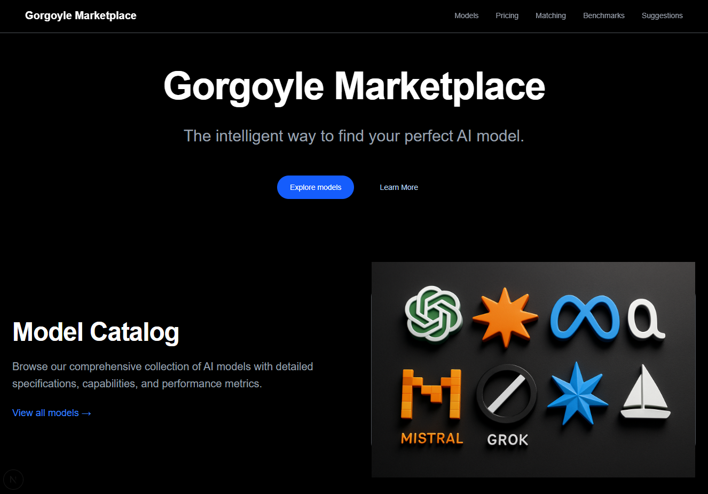
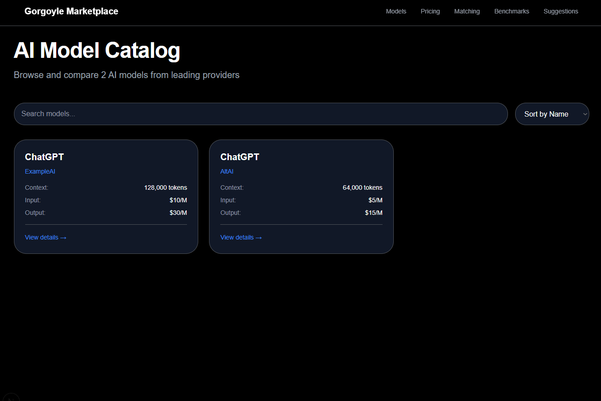
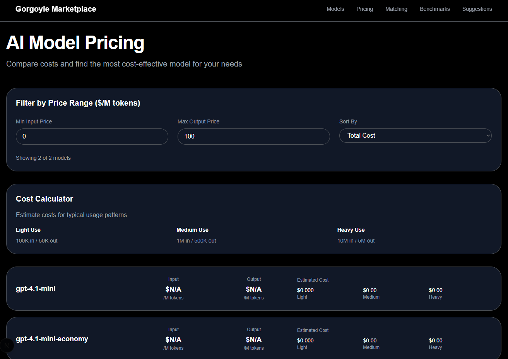

# Gorgoyle Marketplace

> Visual, modular platform for AI model discovery, pricing, benchmarking, and capability matching

---

## Overview

Gorgoyle Marketplace helps teams discover, evaluate, price, and benchmark AI models quickly. The platform focuses on four core capabilities shown below — replace the placeholder image sources with your own URLs or repository paths.


### Front Page

An overview and entry points to the platform's primary features.

<p align="center">
    
</p>

### Model Catalog

Browse models, versions, and capability metadata.

<p align="center">
    
</p>

### Smart Pricing

Compare costs and understand pricing structures across providers.

<p align="center">
    
</p>

### Benchmarks

View performance metrics and comparisons to inform decisions.

<p align="center">
    
</p>


## Quick Navigation
| Section                | Description                                 |
|------------------------|---------------------------------------------|
| [Vision & Problem](./docs/main.md)         | Platform goals, user value, solution         |
| [Backend Services](./docs/backendServices.md) | API, data models, service catalogue          |
| [Web Frontend Pages](./docs/web-frontend-pages.md) | UI, main pages, components, visuals         |
| [API Services](./docs/api-services.md)     | Endpoints, usage, data models                |
| [Setup Guide For Frontend Devs](./SETUP.frontend.md)                  | Install, run, environment, troubleshooting   |
| [Setup Guide For Backend Devs](./SETUP.backend.md) | Install, run, environment, database, migrations, troubleshooting |
| [Troubleshooting & FAQ](./docs/troubleshooting.md) | Common issues, FAQ, support                 |

### Getting Started

1. **Clone the repository:**

    ```sh
    git clone https://github.com/Noname01010101/ai-store.git
    cd ai-store
    ```

**Note: Follow either backend setup or frontend setup**

---

## Testing & Quality

- All services use Vitest for unit/integration tests
- Linting and type-checking enforced in CI
- See [Backend Services Documentation](./docs/backendServices.md#testing-strategy)

---

## Deployment

- Containerized via Docker
- Orchestrated with `docker-compose` (dev) or Kubernetes (prod)
- Blue/green and canary deploys supported
- See [Backend Services Documentation](./docs/backendServices.md#deployment--cicd)

---

## Contributing

We welcome contributions! Please:

- Read the [Platform Vision](./docs/main.md) and [Backend Services Documentation](./docs/backendServices.md)
- Open issues for bugs/feature requests
- Fork and submit PRs with clear descriptions
- Follow our [Code of Conduct](./CODE_OF_CONDUCT.md) (if present)

---

## Contact & Support

- For business/enterprise: [Contact Page](./docs/web-frontend-pages.md#contact-page)
- For technical support: open an issue or contact the Platform Engineering Team
- Slack: #platform-ops (internal)

---

## License

This project is licensed under the MIT License. See [LICENSE](./LICENSE) for details.
